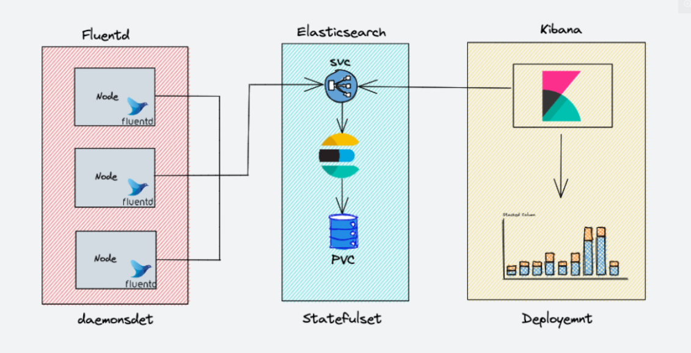

# centralized-logging-infrastructure

setup EFK stack on Kubernetes cluster for log streaming, log analysis, and log monitoring.
### EFK Archiecture



### Deploy Elasticsearch Statefulset

Elasticsearch is deployed as a Statefulset and the multiple replicas connect with each other using a headless service. The headless svc helps in the DNS domain of the pods.
### Verify Elasticsearch Deployment

After the Elastisearch pods come into the running state, let us try and verify the Elasticsearch statefulset. The easiest method to do this is to check the status of the cluster. In order to check the status, port-forward the Elasticsearch pod’s 9200 port.
```
# kubectl port-forward es-cluster-0 9200:9200
```
To check the health of the Elasticsearch cluster, run the following command in the terminal.
```
# curl http://localhost:9200/_cluster/health/?pretty

```
If you do a nslookup from a pod running inside the same namespace of your cluster, you’ll be able to get the address of the above pods through the headless svc. 

```
nslookup es-cluster-0.elasticsearch.default.svc.cluster.local
 
```
### Deploy Kibana Deployment & Service

Kibana can be created as a simple Kubernetes deployment. If you check the following Kibana deployment manifest file, we have an env var ELASTICSEARCH_URL defined to configure the Elasticsearch cluster endpoint. Kibana uses the endpoint URL to connect to elasticsearch.

### Verify Kibana Deployment

After the pods come into the running state, let us try and verify Kibana deployment. The easiest method to do this is through the UI access of the cluster.

To check the status, port-forward the Kibana pod’s 5601 port. If you have created the nodePort service, you can also use that.
```
kubectl port-forward <kibana-pod-name> 5601:5601
```

After this, access the UI through the web browser or make a request using curl
```
curl http://localhost:5601/app/kibana
```


### Deploy Fluentd Kubernetes Manifests

Fluentd is deployed as a daemonset since it has to stream logs from all the nodes in the clusters. In addition to this, it requires special permissions to list & extract the pod’s metadata in all the namespaces.

Kubernetes Service accounts are used for providing permissions to a component in kubernetes, along with cluster roles and cluster rolebindings. Let’s go ahead and create the required service account and roles.

### Create Fluentd Cluster Role

A cluster role in kubernetes contains rules that represent a set of permissions. For fluentd, we want to give permissions for pods and namespaces.

### Create Fluentd Service Account

A service account in kubernetes is an entity to provide identity to a pod. Here, we want to create a service account to be used with fluentd pods.

### Creste Fluentd Cluster Role Binding

A cluster rolebinding in kubernetes grants permissions defined in a cluster role to a service account. We want to create a rolebinding between the role and the service account created above. 

### Reference url
```
https://devopscube.com/setup-efk-stack-on-kubernetes/
```
```
https://www.digitalocean.com/community/tutorials/how-to-set-up-an-elasticsearch-fluentd-and-kibana-efk-logging-stack-on-kubernetes
```
```
https://github.com/fluent/fluentd/issues/2545
```
